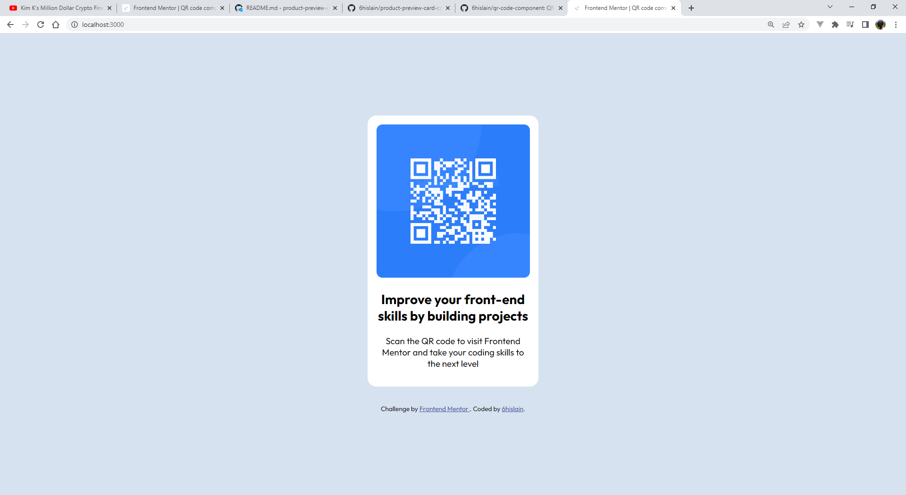

# Frontend Mentor - QR code component solution

This is a solution to the [QR code component challenge on Frontend Mentor](https://www.frontendmentor.io/challenges/qr-code-component-iux_sIO_H). Frontend Mentor challenges help you improve your coding skills by building realistic projects.

## Table of contents

- [Overview](#overview)
  - [Screenshot](#screenshot)
  - [Links](#links)
- [My process](#my-process)
  - [Built with](#built-with)
  - [What I learned](#what-i-learned)
  - [Continued development](#continued-development)
  - [Useful resources](#useful-resources)
- [Author](#author)
- [Acknowledgments](#acknowledgments)

## Overview

### Screenshot



### Links

- Solution URL: [github.com/6hislain/qr-code-component](https://github.com/6hislain/qr-code-component)
- Live Site URL: [demo on netlify](https://benevolent-palmier-51a41d.netlify.app/)

## My process

### Built with

- Semantic HTML5 markup
- CSS custom properties
- Flexbox

### What I learned

I learnt to center a card in the middle of a page using flexbox

```html
<!-- index.html line 25 -->
<div class="card">
  
  <h2>Improve your front-end skills by building projects</h2>
  <p>
    Scan the QR code to visit Frontend Mentor and take your coding skills to the
    next level
  </p>
</div>
```

```css
/* css/style.css line 9 */
.container {
  display: flex;
  flex-direction: column;
  align-items: center;
  justify-content: center;
  max-width: 1440px;
  margin: auto;
  gap: 30px;
  min-height: 100vh;
}

.card {
  background: hsl(0, 0%, 100%);
  width: 260px;
  padding: 15px;
  border-radius: 15px;
  text-align: center;
}
```

### Continued development

I am going to try completing more coding challenges on _Frontend Mentor_

### Useful resources

- [CSS Tricks - flexbox guide](https://css-tricks.com/snippets/css/a-guide-to-flexbox/) - this article guided me on how to use flexbox
- [W3 School - css media queries](https://www.w3schools.com/css/css3_mediaqueries.asp) - this also helped me on media queries

## Author

- Bio Link - [bio.link/6hislain](https://www.bio.link/6hislain)
- Frontend Mentor - [@6hislain](https://www.frontendmentor.io/profile/6hislain)
- Twitter - [@6hislain](https://www.twitter.com/6hislain)

## Acknowledgments

Thanks to [Kevin Powell](https://www.youtube.com/kepowob) youtube videos, I started doing _Frontend Mentor_ challenges
